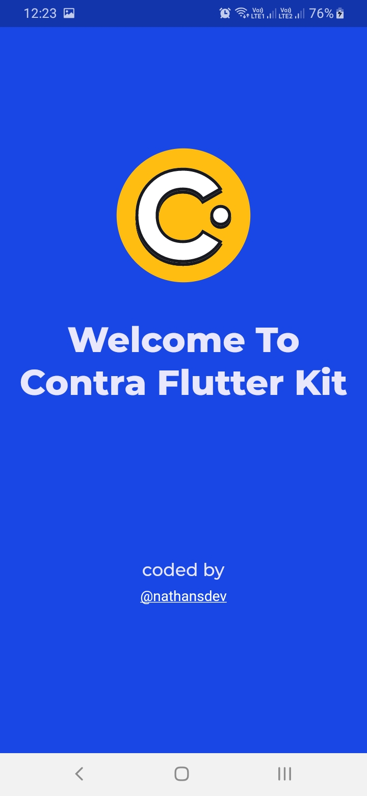

## Contra Flutter Kit

Flutter application built on top of contra wireframe kit. Thorough this project i will be developing all the screens in flutter and sharing in couple of series post.

  

## Kits

Contra flutter kit will be having screens developed in all the categories.(Currently only onboarding kit is available)
- Onboarding
- Login Forms
- Menus
- Dialogs
- Toast
- Chat Screens
- Shopping screens
- Blogs

## Screenshots

- Onboarding and Splash screens

- Login, Verification, Contact Us Forms

- Chat Screens

- Shopping Screen Types

- Blog Screen Types

## Mentions
- Special thanks to [vijay verma](https://twitter.com/realvjy) for the awesome design kit.
- Link to the wireframe official page [Contra wireframe kit](https://contrauikit.com/)

